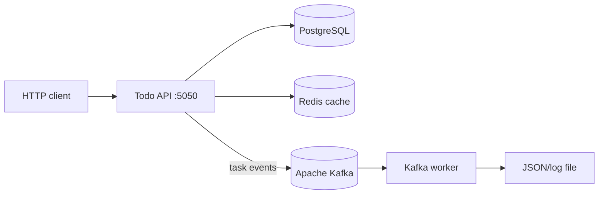

# TaskFlow

REST API для управления задачами и пользователями на Go. Проект построен вокруг PostgreSQL, Redis и Kafka: PostgreSQL хранит основные данные, Redis кэширует статистику, а Kafka worker записывает пользовательские события в лог.

## Возможности

- CRUD для пользователей и задач
- конкурентная обработка HTTP-запросов через `net/http`
- оптимистическая блокировка записей по полю `version`
- статистика по задачам с опциональной фильтрацией
- кэш статистики в Redis
- публикация событий действий пользователя в Kafka
- отдельный Kafka worker для чтения и логирования событий
- миграции PostgreSQL
- Swagger UI и OpenAPI-описание API
- graceful shutdown по `SIGINT` и `SIGTERM`

## Архитектура



Событие Kafka содержит:

```json
{
	"timestamp": "2026-08-30T12:40:48Z",
	"action": "task_created"
}
```

Поддерживаемые действия: `task_created`, `task_updated`, `task_deleted`, `task_listed`, `tasks_listed`.

## Стек

- Go 1.25
- PostgreSQL 18
- Redis 8
- Apache Kafka 3.9 в KRaft-режиме
- `pgx/v5` и `pgxpool`
- `segmentio/kafka-go`
- `go-redis`
- `zap`
- Docker Compose

## Быстрый старт

### Требования

- Go 1.25 или новее
- Docker и Docker Compose
- GNU Make

### Конфигурация

Создайте локальный файл окружения:

```bash
cp .env.example .env
```

Заполните в `.env` минимум параметры PostgreSQL:

```dotenv
POSTGRES_USER=todoapp
POSTGRES_PASSWORD=todoapp
POSTGRES_DB=todoapp
```

Kafka включена по умолчанию в `.env.example`:

```dotenv
KAFKA_ENABLED=true
```

### Запуск инфраструктуры

Выполняйте команды из корня проекта:

```bash
make env-up
make migrate-up
make kafka-up
make kafka-topic-create
make kafka-worker-up
make todoapp-deploy
```

После запуска API будет доступен по адресу [http://localhost:5050](http://localhost:5050).

Swagger UI: [http://localhost:5050/swagger/index.html](http://localhost:5050/swagger/index.html)

Список запущенных контейнеров:

```bash
make ps
```

## Проверка Kafka

1. Убедитесь, что топик создан:

	 ```bash
	 make kafka-topic-list
	 ```

2. Выполните любое действие с задачей через API: создание, получение, обновление или удаление.

3. Проверьте вывод worker:

	 ```bash
	 docker compose logs -f kafka-worker
	 ```

4. Файлы worker находятся в `out/logs/kafka-worker`.

Если Kafka выключена, API использует `NoopPublisher` и продолжает работать без публикации событий:

```dotenv
KAFKA_ENABLED=false
```

## Примеры API

Создать пользователя:

```bash
curl -X POST http://localhost:5050/api/v1/users \
	-H 'Content-Type: application/json' \
	-d '{"full_name":"Ivan Ivanov","phone_number":"+7999887766"}'
```

Создать задачу:

```bash
curl -X POST http://localhost:5050/api/v1/tasks \
	-H 'Content-Type: application/json' \
	-d '{"author_user_id":1,"title":"Изучить Kafka","description":"Проверить producer и consumer"}'
```

Получить список задач:

```bash
curl 'http://localhost:5050/api/v1/tasks?limit=10&offset=0'
```

Получить статистику:

```bash
curl 'http://localhost:5050/api/v1/statistics'
```

Полное описание параметров и ответов доступно в Swagger UI и [docs/swagger.yaml](docs/swagger.yaml).

## Полезные команды

| Команда | Назначение |
| --- | --- |
| `make env-up` | Запустить PostgreSQL |
| `make migrate-up` | Применить миграции |
| `make migrate-down` | Откатить миграции |
| `make todoapp-deploy` | Собрать и запустить API |
| `make todoapp-undeploy` | Остановить API |
| `make kafka-up` | Запустить Kafka |
| `make kafka-down` | Остановить Kafka |
| `make kafka-worker-up` | Собрать и запустить worker |
| `make kafka-logs` | Смотреть логи Kafka |
| `make kafka-topic-create` | Создать топик событий |
| `make kafka-topic-list` | Показать топики |
| `make logs-cleanup` | Очистить локальные логи |
| `make env-cleanup` | Удалить окружение PostgreSQL и его данные |

Остановить все сервисы можно командой:

```bash
docker compose down
```

## Структура проекта

```text
cmd/
	todoapp/       # HTTP API
	kafka-worker/  # Kafka consumer
internal/
	core/          # конфигурация, транспорт, БД, Redis, Kafka, логирование
	features/      # users, tasks, statistics, web
migrations/      # SQL-миграции PostgreSQL
docs/            # Swagger/OpenAPI
public/          # статические файлы веб-приложения
docker-compose.yaml
Makefile
```

## Локальный запуск без Docker API

Для запуска Go-приложения локально PostgreSQL должен быть доступен на `localhost`:

```bash
make env-up
make migrate-up
make todoapp-run
```

В этом режиме адрес Kafka также должен быть доступен локально. Для запуска только инфраструктуры Kafka используйте Docker, а в конфигурации приложения укажите:

```dotenv
KAFKA_BROKERS=localhost:9092
```

## Лицензия

Лицензия пока не указана.
